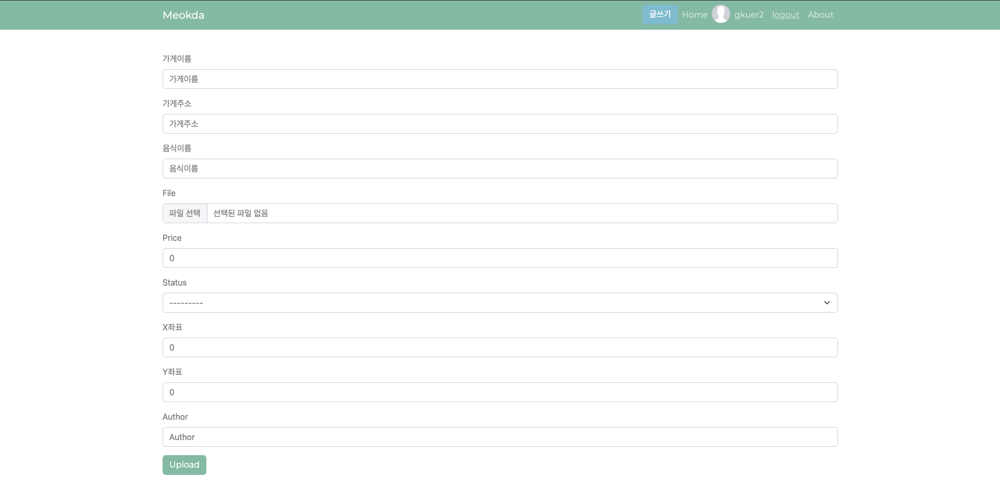

# Meokda 먹다 - 먹고싶은거 다있다.

## 현위치기반 맛집 음식동영상 플랫폼

### 	Version Update Record

* Entire Code Update (21.09.19.)
* 최초 완성 및 Web 배포 (21.05.10.)


## 설명

점심 뭐먹지? 저녁 뭐먹지? 야식 뭐먹지? <br>
하루 3번하는 고민! 현재 위치 주변 맛집들 영상 보면서 선택하자!<br><br>

현재 자신의 위치 주변에 맛집들의 음식 동영상들이 와르르!<br>
뭐 먹을지 고민하고 있나요? 우리가 도와줄게요.


## 1. 프로젝트 종류 - Solo

- 팀원 : Gkuer


## 2. 프로젝트 구조


## 2.1 Login


미배포로 Social Login 미구현

기존 버전과 내용은 같으나, Navbar를 include 이용으로 변경, Http Method 및 Next 파라미터에 대한 반응 추가

* accounts/views.py

```python
@require_http_methods(["GET", "POST"])
def login(request):
    if request.method == "POST":
        form = AuthenticationForm(request, request.POST)
        if form.is_valid():
            auth_login(request, form.get_user())
            return redirect(request.GET.get('next') or 'videos:main')
    else:
        form = AuthenticationForm()
    context = {
        'form': form
    }
    return render(request, 'accounts/login.html', context)
```


## 2.2 Signup


기존: 회원가입은 username, age, sex, email 및 password 정보 입력

업데이트: ModelForm으로 변경하며 접근 권한 및 제한, 최소 field만 입력하도록 변경

```python
@require_http_methods(["GET","POST"])
def signup(request):
    if request.method == "POST":
        form = UserCreationForm(request.POST)
        if form.is_valid():
            user = form.save()
            auth_login(request, user)
        return redirect("videos:main")

    else:
        form = UserCreationForm()
    context = {
        'form': form,
    }
    return render(request, 'accounts/signup.html', context)
```


## 2.3 Navbar


기존: 프로필 사진 및 검색칸 활성화

업데이트: 장고에서 권장하는 장고 기본 User모델로 변경함에 따라 추후 업데이트 예정

```django

<!-- navbar -->
  <section style='position: fixed; z-index:666;top:0; right: 0; left:0;'>
    <nav class="navbar navbar-expand-lg navbar-dark bg-primary mb-5">
      <div class="container">
        <a class="navbar-brand" href="">Meokda</a>
        <ul class="navbar-nav ml-auto">
        <a href=""><button type="button" class="btn btn-info mr-5" style="white-space:nowrap;">글쓰기</button></a>
          <li class="nav-item active">
            <a class="nav-link" href="">Home
            </a>
          </li>
          
          <li class="nav-item " style="margin-top: 3;">
            <div class="box"
              style="background: #BDBDBD; width: 35px; height: 35px; border-radius: 70%; overflow: hidden;">
              
            </div>
          </li>
          <li class="nav-item">
            <a class="nav-link"href=""> {{ request.user }} </a>
          </li>
          <li class="nav-item">
            <form class="d-inline"action="" method="POST">
            
              <button class="btn btn-link" style='color: #c9e6dd; padding: 8px; border:0px;'>logout</button>
            </form>
          </li>
          <li class="nav-item">
            <a class="nav-link" href="/accounts/about">About</a>
          </li>
          
          <li class="nav-item">
            <a class="nav-link" href="">Login</a>
          </li>
          <li class="nav-item">
            <a class="nav-link" href="">About</a>
          </li>

          
        </ul>
    </nav>
  </section>

```


## 2.1.4 Video Upload



기존: 


		 1) 가게이름을 검색하는 동안 실시간으로 추천목록이 AutoComplete으로 뜨게하였습니다. key up down으로 감지하여 ajax를 통하여 해당 Inputdata를 view로 전송하였고, view에서는 naver open api를 이용하여 해당 글자에 맞는 검색결과를 끌어와 template으로 전송하였습니다.
		 2) 사용자가 가게이름을 쓰는 동안, 그리고 다 쓴 후, 실시간으로 가게 주소를 가게 주소칸에 value를 바꿔 자동으로 작성되게 하였으며, X좌표와 Y좌표 또한 기입되게 하여 나중에 거리산출에 쓰일 수 있도록 구성하였습니다. 모두 네이버 open api에서 items목록에서 뽑아왔으며, 좌표의 경우에는 네이버는  tm 128(카텍) 좌표를 송출하여 latlng형식으로 바꿔준 뒤 데이터베이스에 저장하였습니다.  
		 3) 동영상 형식만 올릴 수 있도록 파일업로드를 form.py를 통해 제한하였으며, 형식을 모두 채울 경우에만 post되도록 하였습니다.


업데이트: ModelForm으로 변경, 기존 기능 및 디자인은 추후 업데이트 예정

```python
@login_required
@require_http_methods(["GET","POST"])
def upload(request):
    if request.method == "POST":
        form = VideoUploadForm(request.POST, request.FILES)
        if form.is_valid():
            form.save()
            return redirect('videos:main')
    else:
        form = VideoUploadForm()
    context = {
        'form': form,
    }
    return render(request, 'videos/upload.html', context)
```


## 2.5 Main


기존:

```
1) 사용자 현위치 기준 Map과 로드뷰를 출력하였습니다. 동시에, 현재 좌표를 함께 볼 수 있도록 구성하였습니다.  
2) 스크롤은 Infinite Scroll을 적용하여 무한으로 내리면서 영상을 감상할 수 있도록 구성하였고, 동영상을 사용자 현위치 기반 거리순으로 정렬하려고 하였으나 해당 부분 성공하지 못했습니다. 
3) 동영상은 모두 자동재생으로 시청할 수 있으며, Scroll이 내려옴과 동시에 화면에 출력되는 동영상이 재생될 수 있도록 개발하였습니다. 
4) 동영상을 한번 누르면 소리가 켜지고, 다시 누르면 소리가 꺼지도록 구성하였으며, 소리가 켜진 상태에서 스크롤을 내리면 소리가 자동으로 꺼지도록 개발하였습니다. 
5) 다만, Infinite Scroll과 소리재생,멈춤, Scroll Top을 이용한 동영상 자동 재생,정지가 복합적으로 간헐적인 버그를 일으키고 있으며, 이부분 해결하지 못하였습니다. 
6) 가게명을 클릭할 시, 네이버 지도에 해당 가게로 이동하도록 링크하여 사용자가 바로 다음 작업을 진행할 수 있도록 만들었습니다. 또한, 게시자의 아이디를 클릭할 시에는 해당 게시자의 프로필로 이동합니다.
```


업데이트: 라이브러리 및 거리계산, 버그개선을 위해 코드 간략화 및 일부 기능 비활성화. 추후 기존 목표대로 업데이트 진행 예정

```django



<html>
<head>
  <meta charset="utf-8">
  <meta name="viewport" content="width=device-width, initial-scale=1">

  <!-- load static files -->
  <link rel="stylesheet" href=""> 
  <link rel="stylesheet" href="">
  <script src="https://ajax.googleapis.com/ajax/libs/jquery/3.5.1/jquery.min.js"></script>
  <script src=""></script>
  <script src=""></script>
  <link rel="stylesheet" href="">
</head>

<body>
  <!-- Navbar -->
  

  <!-- Contents -->
  <div style="height:75;">
  </div>

  <!-- 현위치 지도 및 로드뷰 -->
  <div class="container text-center infinite-container">
    <div>
      <div id="map" style="float:left; width:50%;height:350px;"></div>
      <div id="roadview" style="float:right; width:50%;height:350px;"></div>
    </div>
    <script type="text/javascript" src="//dapi.kakao.com/v2/maps/sdk.js?appkey=2c99e3a99399a45d1eb7c7fa9158f4d0"></script>
    <script>
      var mapContainer = document.getElementById('map'), // 지도를 표시할 div 
        mapOption = {
          center: new kakao.maps.LatLng(33.450701, 126.570667), // 지도의 중심좌표
          level: 3 // 지도의 확대 레벨 
        };
      var map = new kakao.maps.Map(mapContainer, mapOption); // 지도를 생성합니다
      // 지도에 확대 축소 컨트롤을 생성한다
      var zoomControl = new kakao.maps.ZoomControl();
      // 지도의 우측에 확대 축소 컨트롤을 추가한다
      map.addControl(zoomControl, kakao.maps.ControlPosition.RIGHT);
      // HTML5의 geolocation으로 사용할 수 있는지 확인합니다 
      if (navigator.geolocation) {
        // GeoLocation을 이용해서 접속 위치를 얻어옵니다
        navigator.geolocation.getCurrentPosition(function (position) {
          var lat = position.coords.latitude, // 위도
            lon = position.coords.longitude; // 경도
          var locPosition = new kakao.maps.LatLng(lat, lon), // 마커가 표시될 위치를 geolocation으로 얻어온 좌표로 생성합니다
            message = '<div style="padding:5px;">사용자 현재 위치</div>'; // 인포윈도우에 표시될 내용입니다
          // 마커와 인포윈도우를 표시합니다
          displayMarker(locPosition, message);
          var roadviewContainer = document.getElementById('roadview'); //로드뷰를 표시할 div
          var roadview = new kakao.maps.Roadview(roadviewContainer); //로드뷰 객체
          var roadviewClient = new kakao.maps.RoadviewClient(); //좌표로부터 로드뷰 파노ID를 가져올 로드뷰 helper객체
          var position = new kakao.maps.LatLng(lat, lon);
          // 특정 위치의 좌표와 가까운 로드뷰의 panoId를 추출하여 로드뷰를 띄운다.
          roadviewClient.getNearestPanoId(position, 50, function (panoId) {
            roadview.setPanoId(panoId, position); //panoId와 중심좌표를 통해 로드뷰 실행
          });
        });
      } else { // HTML5의 GeoLocation을 사용할 수 없을때 마커 표시 위치와 인포윈도우 내용을 설정합니다
        var locPosition = new kakao.maps.LatLng(33.450701, 126.570667),
          message = 'geolocation을 사용할수 없어요..'
        displayMarker(locPosition, message);
      }
      // 지도에 마커와 인포윈도우를 표시하는 함수입니다
      function displayMarker(locPosition, message) {
        // 마커를 생성합니다
        // 마커 이미지의 주소
        var markerImageUrl = 'https://ifh.cc/g/BdRk4F.png',
          markerImageSize = new kakao.maps.Size(40, 42), // 마커 이미지의 크기
          markerImageOptions = {
            offset: new kakao.maps.Point(20, 42)// 마커 좌표에 일치시킬 이미지 안의 좌표
          };
        // 마커 이미지를 생성한다
        var markerImage = new kakao.maps.MarkerImage(markerImageUrl, markerImageSize, markerImageOptions);
        var marker = new kakao.maps.Marker({
          map: map,
          image: markerImage,
          position: locPosition
        });
        var iwContent = message, // 인포윈도우에 표시할 내용
          iwRemoveable = true;
        // 인포윈도우를 생성합니다
        var infowindow = new kakao.maps.InfoWindow({
          content: iwContent,
          removable: iwRemoveable
        });
        // 인포윈도우를 마커위에 표시합니다 
        infowindow.open(map, marker);
        // 지도 중심좌표를 접속위치로 변경합니다
        map.setCenter(locPosition);
      }
    </script>

    <!-- 현위치 좌표 -->
    <script>
      function returnPosition(x) {
        navigator.geolocation.getCurrentPosition(function (position) {
            var lat = position.coords.latitude, // 위도
            lon = position.coords.longitude; // 경도
          document.getElementById(x).innerHTML = "위도:" + lat + ", " + "경도:" + lon;
        })
      };
    </script>

    <!-- 현위치 좌표 표시 -->
    <div id="whereiam">
    </div>
    <script>returnPosition("whereiam")</script>


    <!-- 비디오 나열 -->
    
    <div class="card text-center mt-5 infinite-item">
      <div class="mt-1">
        <!-- 관리자 권한 -->
        
        <a href="/"><button class="btn btn-info">삭제하기</button></a>
        
        <a>Meokda {{ video.pk }}번째 비디오</a>
        
      </div>

      <!-- 비디오 나열 -->
      <div class="card-header bg-transparent">
        <div class="d-flex justify-content-between">
          <a class="nav-link navbar-brand  text-muted" href='https://map.naver.com/v5/search/{{video.restaurant}}'
            target='_blank'>
            <h4>{{video.restaurant}}</h4>
          </a>
          <a class="nav-link navbar-brand  text-muted mr-auto" href="#"><small id = "{{video.mapx}}"> 5km </small></a>
          <a class="nav-link  navbar-brand  text-muted " href="UserProfile/{{video.author}}">{{video.author}}</a>
          </li>
        </div>

        <div class="d-flex justify-content-between">
          <div class="d-flex">
          <a class="nav-link navbar-brand  text-muted" href="#">{{ video.foodname }}</a>
          <a class="nav-link navbar-brand  text-muted mt-1" href="#"><small>{{video.price | intcomma}}원</small></a>
          </div>
          <div>
          <a class="nav-link navbar-brand text-muted" href="#">{{ video.get_status_display }}</a>
          </div>
        </div>
      </div>


      <div class="card-body" style="padding:0;">
        <video id='video{{video.id}}' class="video center align-middle" controls="true" autoplay muted loop playsinline
          style='max-width: 100%; max-height: 700px;' onclick="unmute('video{{video.id}}')">
          <source src="{{ video.file.url }}" type="video/mp4">
          </source>
          Your browser does not support the video tag.
        </video>

        <!-- 클릭 시 mute/unmute 동작 -->
        <script>
          function unmute(self) {
            var $video = $('#video{{video.id}}');
            const player = document.getElementById(self);
            if (player.muted) {
              player.muted = false;
            }
            else {
              player.muted = true;
            }
            if (player.pause()) {
              $video[0].play();
            }
          }
        </script>
      </div>
    </div>
    
  </div>

  <!-- infinite scroll -->
  
  <a class="infinite-more-link" href="?page={{ page_obj.next_page_number }}">More</a>
  

  <script>
    var infinite = new Waypoint.Infinite({
      element: $('.infinite-container')[0],

      onBeforePageLoad: function () {
        $('.loading').show();
      },
      onAfterPageLoad: function ($items) {
        $('.loading').hide();
      }
    });
  </script>
  <script src="https://cdn.jsdelivr.net/npm/bootstrap@5.0.0-beta1/dist/js/bootstrap.bundle.min.js"
    integrity="sha384-ygbV9kiqUc6oa4msXn9868pTtWMgiQaeYH7/t7LECLbyPA2x65Kgf80OJFdroafW"
    crossorigin="anonymous"></script>

  <!-- 스크롤에 따른 비디오 재생/정지 -->
  <script>
    $(function () {

      var $video = $('#video{{video.id}}');
      var $window = $(window);


      $window.scroll(function () {
        var $topOfVideo = $video.offset().top;
        var $bottomOfVideo = $video.offset().top + $video.outerHeight();
        var $topOfScreen = $window.scrollTop();
        var $bottomOfScreen = $window.scrollTop() + $window.innerHeight();

        if (($topOfScreen < $topOfVideo) && ($bottomOfScreen > $bottomOfVideo)) {
          $video[0].play();
        } else {
          $video[0].pause();
        }
      });
    });
  </script>
  
</body>
</html>
```


## 2.6 Profile

기존: 


```
1. 프로필 사진과 코멘트, 자신이 올린 동영상을 프로필페이지에서 볼 수 있도록 하였으며, 해당 프로필 주인과 게스트를 구별하여 페이지 url 설정 및 접근권한 부여하였습니다.  
2. 프로필 주인의 경우에는 자신이 올렸던 동영상을 삭제할 수 있도록 구현하였습니다.  
3. 프로필페이지 역시 Infinite Scroll 및 Scroll Top을 이용한 동영상 시청으로 구현하였습니다.
```


업데이트: Django에서 권하는 Django User모델 사용 및 해당 DB 사용방식 변경으로 인해 비활성화


<h3 style = "text-align:center;"> gkuer7

